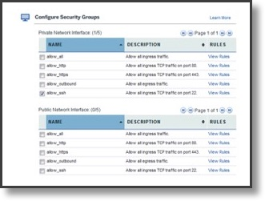

---

copyright:
  years: 2017, 2018
lastupdated: "2018-04-04"

---

{:shortdesc: .shortdesc}
{:codeblock: .codeblock}
{:screen: .screen}
{:new_window: target="_blank"}
{:pre: .pre}
{:table: .aria-labeledby="caption"}

# Step-by-step: Adding a pre-defined Security Group during ordering
This step-by-step procedure shows you how to add existing or pre-defined security groups to instances during the ordering process.

You can use Security Groups to enact a set of IP filter rules that define how to handle incoming and outgoing traffic to both the public and private interfaces of a virtual server instance.

## What you'll need
For this example the following objects and items will be used:

| Resource Name  | Operating System | Type | Location/DC | IP/Subnet |
|:------------- |:---------------:| -------------:| :---------------:| ---------------:|
| allow_ssh1 | Not Applicable  | Security Group | Not Applicable/Any | 0.0.0.0/0 |
|jpmongevsi2.testing.com | Ubuntu 16.04 | Virtual server instance | Dallas 10 Pod 01 | 10.0.0.21 |	
|jpmongevsi4.testing.com | Ubuntu 16.04 | Virtual server instance |	Dallas 10 Pod 01	| 10.0.2.219 |

## Order a Security Group
To order a virtual server instance and assign a security group, perform the following procedure:

1. From your browser, open [Customer Portal ](https://control.softlayer.com/) and log in to your account.
2. Locate the **Order** section and click **Devices**.
3. On the Devices page, click **Hourly** or **Monthly** for one of the Virtual Server offerings.
4. On the Configure your Cloud Server order page, you must select a data center that supports security groups.
5. Complete any other necessary information and click **Add to Order**. The Checkout page opens.
6. Confirm the following information for the VSI: 

	* Location
	* Specs
	* Network port options. 

7. From **Configure Security Groups**, select the desired Security Group to be applied. The associated rules with each Security Group can be displayed by clicking the **View Rules** link. 

	

	You can select any of the predefined security groups to apply to the private or public interfaces on the virtual server.
	
8. Specify the instance name.
9. Mark the Cloud Service terms and the Third-Party Service Agreement check box if applicable.
10. Finally, click **Submit Order**.
