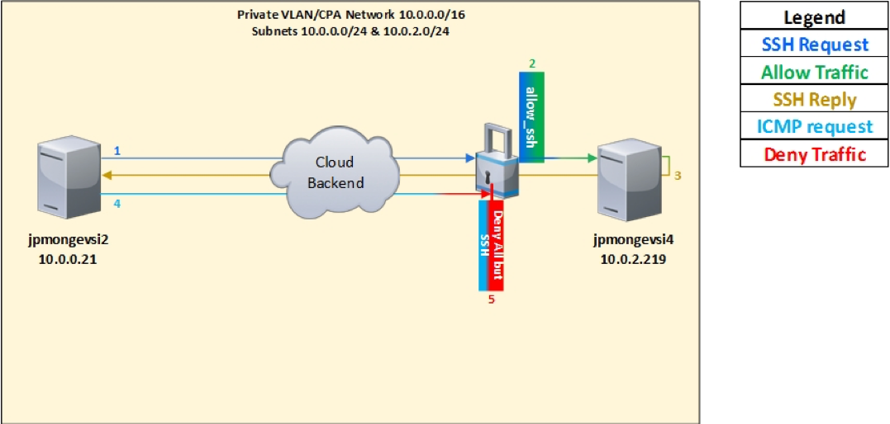

---

copyright:
  years: 2017, 2024
lastupdated: "2024-10-10"

keywords: add, order, group

subcollection: security-groups
---

{{site.data.keyword.attribute-definition-list}}

# Adding a predefined security group during ordering
{: #adding-a-pre-defined-security-group-during-ordering}

This step-by-step procedure shows you how to add existing or predefined {{site.data.keyword.cloud}} security groups to instances during the ordering process.
{: shortdesc}

You can use security groups to enact a set of IP filter rules that define how to handle incoming and outgoing traffic to both the public and private interfaces of a virtual server instance.

{: caption="Custom security group" caption-side="bottom"}

## What you'll need
{: #what-you-ll-need-2}

For this example the following objects and items are used:

| Resource Name  | Operating System | Type | Location/DC | IP/Subnet |
|:------------- |:---------------:| -------------:| :---------------:| ---------------:|
| allow_ssh1 | Not Applicable  | Security Group | Not Applicable/Any | 0.0.0.0/0 |
|jpmongevsi2.testing.com | Ubuntu 16.04 | Virtual server instance | Dallas 10 Pod 01 | 10.0.0.21 |
|jpmongevsi4.testing.com | Ubuntu 16.04 | Virtual server instance |	Dallas 10 Pod 01	| 10.0.2.219 |
{: caption="What you'll need" caption-side="bottom"}

## Ordering a security group
{: #order-a-security-group}

To order a virtual server instance and assign a security group, follow these steps:

1. From your browser, open the [IBM Cloud Catalog](https://cloud.ibm.com/catalog) and log in to your account.
1. Select **Compute** on the left side of the page, then click on the **Virtual Server** tile to get to the Virtual Server page.
1. Configure your virtual server based on your requirements.

   For complete information on provisioning a virtual server instance, refer to the [Virtual Server Instance documentation](/docs/virtual-servers).

1. From the Network Interface section, use the menus to select any predefined private or public security groups for your virtual server instance.

   Only predefined security groups display in these menu lists. To define a new security group, refer to [Creating security groups and rules](/docs/security-groups?topic=security-groups-creating-security-groups)

1. Select the Cloud Service terms and the Third-Party Service Agreement check box.
1. Finally, click **Create**.
