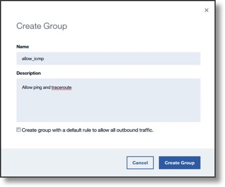

---

copyright:
  years: 2017
lastupdated: "2018-11-10"

keywords: create, configure, configuration, custom

subcollection: security-group

---

{:shortdesc: .shortdesc}
{:codeblock: .codeblock}
{:screen: .screen}
{:new_window: target="_blank"}
{:pre: .pre}
{:note: .note}
{:important: .important}
{:tip: .tip}
{:table: .aria-labeledby="caption"}

# Creating a Security Group
{: #creating-a-security-group}

Create and configure a custom security group:

1. From your browser, open the [Customer Portal ](https://cloud.ibm.com/classic){: new_window} and log into your account.
2.	Select the **Security** tab.
3. From **Network Security** select **Security Groups**.
4.	Click **Create Group +**.
5.	Enter a name for the Security Group and optionally a description.
6. Click **Create Group**.

Note that the **Create group with a default…** checkbox is unmarked. This means no outbound rule will be created for this Security Group object. As a result, unless other outbound rules or Security Group objects are created, only incoming requests (such as SSH and ICMP) and their related (outgoing) traffic flows or responses will be permitted.

## Next step...
{: #next-step-2}

[Create a rule](/docs/infrastructure/security-groups?topic=security-groups-creating-a-new-rule) to allow incoming requests (SSH & ICMP) and their related (outgoing) traffic flows.  
