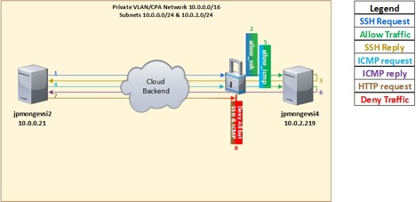

---

copyright:
  years: 2017
lastupdated: "2018-11-10"

keywords: create, manage, custom, instance, assign, edit

subcollection: security-group

---

{:shortdesc: .shortdesc}
{:codeblock: .codeblock}
{:screen: .screen}
{:new_window: target="_blank_"}
{:pre: .pre}
{:table: .aria-labeledby="caption"}
{:note: .note}
{:important: .important}
{:tip: .tip}

# Creating and Managing a Custom Security Group
{: #creating-and-managing-a-custom-security-group}

In this tutorial you will learn how to create, assign instances to, and edit a custom Security Group.

## What you'll need
{: #what-you-ll-need-3}

For this example the following objects and items will be used:

| Resource Name  | Operating System | Type | Location/DC | IP/Subnet |
|:------------- |:---------------:| -------------:| :---------------:| ---------------:|
| Not Applicable/Any | 10.0.0.0/16 |
| allow_icmp | Not Applicable  | Security Group | Not Applicable/Any | 0.0.0.0/0 |
| allow_ssh | Not Applicable | Security Group | Not Applicable/Any | 0.0.0.0/0 |
|jpmongevsi2.testing.com | Ubuntu 16.04 | Virtual server instance | Dallas 10 Pod 01 | 10.0.0.21 |
|jpmongevsi4.testing.com | Ubuntu 16.04 | Virtual server instance |	Dallas 10 Pod 01	| 10.0.2.219 |

Note that this tutorial makes use of a CPA private network/account, however, for practical purposes Security Groups behave the same way in both CPA accounts and regular accounts. Subnets 10.0.0.0/24 and 10.0.2.0/24 belong to the same CPA private network, which would be the equivalent of having a regular account with two or more VSIs connected to the same private subnet/VLAN.

## What you'll accomplish
{: #what-you-ll-accomplish-3}

In this tutorial you will learn how to...

Task  | Description
------------- | -------------
[Create a Security Group](/docs/infrastructure/security-groups?topic=security-groups-creating-a-security-group) | Create and configure a custom security group, as opposed to using one pre-defined by the IBM© cloud platform.
[Create a rule](/docs/infrastructure/security-groups?topic=security-groups-creating-a-new-rule) | Create a rule to allow incoming requests (SSH & ICMP) and their related (outgoing) traffic flows.
[Assign instances to the Security Group](/docs/infrastructure/security-groups?topic=security-groups-assigning-instances-to-the-security-group) | Assign Security Group objects to instances using either the Security Menu or the Device Menu.
[Edit a Security Group and its Rules](/docs/infrastructure/security-groups?topic=security-groups-editing-a-security-group) | Modify the parameters of the Security Object and its rules.
