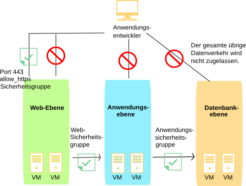

---

copyright:
  years: 2017
lastupdated: "2018-11-10"

---

{:shortdesc: .shortdesc}
{:new_window: target="_blank"}

# Informationen zu IBM Sicherheitsgruppen
{: #about-ibm-security-groups}

## Definition einer Sicherheitsgruppe
Eine *Sicherheitsgruppe* ist eine Gruppe von IP-Filterregeln, die definieren, wie eingehender ('ingress' - Eingangsdatenverkehr) und abgehender
Datenverkehr ('egress' - Ausgangsdatenverkehr) an bzw. von sowohl öffentlichen als auch privaten Schnittstellen einer virtuellen Serverinstanz gehandhabt wird. Die Regeln, die Sie einer Sicherheitsgruppe hinzufügen, werden als *Sicherheitsgruppenregeln* bezeichnet.
{:shortdesc}

* Sie können Sicherheitsgruppen den öffentlichen und/oder privaten Netzschnittstellen eines einzelnen virtuellen Servers oder mehrerer virtueller Serverinstanzen zuordnen.
* Sie können Sicherheitsgruppen zuordnen, die von IBM© bereitgestellt wurden oder die Sie selbst erstellt haben.
* Wenn eine Sicherheitsgruppe für eine Netzkomponente einer virtuellen Serverinstanz angewendet wird, wird der gesamte Datenverkehr zu und von dieser Netzkomponente blockiert, es sei denn, er wird durch eine Sicherheitsgruppenregel explizit zugelassen.
* Der eingehende Datenverkehr einer virtuellen Serverinstanz wird als Eingangsdatenverkehr ('ingress') bezeichnet.
* Der abgehende Datenverkehr einer virtuellen Serverinstanz wird als Ausgangsdatenverkehr ('egress') bezeichnet.

Sicherheitsgruppen werden auf dem Hypervisor implementiert, der den virtuellen Server hostet.

## Von IBM bereitgestellte Sicherheitsgruppen
Sie können den Netzschnittstellen Ihrer virtuellen Serverinstanzen eine beliebige der folgenden, von IBM bereitgestellten
Sicherheitsgruppen zuordnen:

* *allow_ssh*: Diese Sicherheitsgruppe definiert IP-Regeln, die TCP-Eingangsdatenverkehr nur am SSH-Port zulassen (22/TCP).
* *allow_http*: Diese Sicherheitsgruppe definiert IP-Regeln, die Eingangsdatenverkehr nur am HTTP-Port zulassen (80/TCP).
* *allow_https*: Diese Sicherheitsgruppe definiert IP-Regeln, die TCP-Eingangsdatenverkehr nur am HTTPS-Port zulassen (443/TCP).
* *allow_outbound*: Diese Sicherheitsgruppe definiert IP-Regeln, die jeglichen Ausgangsdatenverkehr vom Server zulassen.
* *allow_all*: Diese Sicherheitsgruppe definiert IP-Regeln, die jeglichen Eingangsdatenverkehr auf allen Ports zulassen.

## Sicherheitsgruppen und Auditprotokolle
Alle Interaktionen der Sicherheitsgruppen werden im Auditprotokoll eines Kontos aufgezeichnet. Auditprotokolleinträge verfolgen spezifische Sicherheitsgruppenänderungen und die Benutzer, die diese Änderungen angefordert haben, nach. Protokolle werden für die folgenden Interaktionen geschrieben:
* Eine Sicherheitsgruppe wird der Netzschnittstelle eines virtuellen Servers hinzugefügt oder daraus entfernt.
* Die Regeln einer Sicherheitsgruppe werden durch Befehle zum Hinzufügen, Bearbeiten oder Entfernen von Regeln geändert.

Für jede dieser Interaktionen wird pro betroffenem Objekt ein Protokoll geschrieben. Es wird immer ein Protokoll für die geänderte Sicherheitsgruppe geschrieben. Weitere Protokolle werden für jede Netzschnittstelle von virtuellen Servern geschrieben, die an die Sicherheitsgruppe angehängt sind. Das Filtern von Auditprotokollen für eine spezifische Sicherheitsgruppe zeigt alle sicherheitsgruppenbezogenen Änderungen für die Gruppe. Entsprechend zeigt das Filtern von Protokollen für einen spezifischen virtuellen Server alle sicherheitsgruppenbezogenen Änderungen für den virtuellen Server.

Da Sicherheitsgruppenänderungen dazu führen können, dass eine Reihe von virtuellen Servern im Hintergrund aktualisiert werden, können Auditprotokolle verwendet werden, um genau zu bestimmen, wann eine Änderung in Kraft getreten ist.  Sicherheitsgruppen-APIs, die Auditprotokolle generieren, geben eine Anforderungs-ID zurück. Anhand dieser ID können API-Aufrufe mit ihren resultierenden Auditprotokollen korreliert werden.

## Beispiel
Im folgenden Diagramm sind virtuelle Serverinstanzen einer Reihe von Sicherheitsgruppen zugeordnet,
mit denen der Netzdatenverkehr eingeschränkt wird. Die Pfeile stellen den Datenverkehr im Netz dar. Der Anwendungsentwickler hat den Zugriff auf die verschiedenen Infrastrukturebenen wie folgt eingeschränkt:

* Der Anwendungsentwickler verfügt nur über Zugriff auf die Web-Ebene über TCP-Port 443 (https).
* Nur Instanzen der Web-Ebene verfügen über Zugriff auf die Instanzen der Anwendungsebene.
* Nur Instanzen der Anwendungsebene verfügen über Zugriff auf die Instanzen der Datenbankebene.

 Abbildung 1. Sicherheitsgruppen
