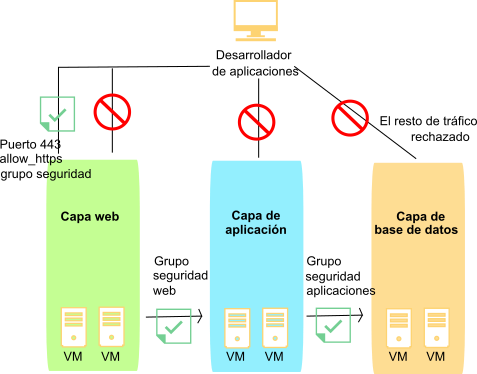

---

copyright:
  years: 2017
lastupdated: "2017-08-08"

---

{:shortdesc: .shortdesc}
{:new_window: target="_blank"}

# Acerca de los grupos de seguridad

## ¿Qué es un grupo de seguridad?
Un *grupo de seguridad* es un conjunto de reglas de filtro de IP que definen cómo gestionar el tráfico de entrada y el de salida a la interfaz pública y privada de una instancia de servidor virtual. Las reglas que se añaden a un grupo de seguridad se conocen como *reglas de grupo de seguridad*.
{:shortdesc}

* Puede asignar grupos de seguridad a las interfaces de red públicas/privadas de un único servidor virtual o a varias instancias de servidor virtual.
* Puede asignar grupos de seguridad proporcionados por IBM o de creación propia.
* Cuando se aplica un grupo de seguridad a un componente de red de una instancia de servidor virtual, se rechaza todo el tráfico desde/hasta ese componente de red, a menos que una regla de grupo de seguridad lo permita explícitamente.
* El tráfico de entrada a una instancia de servidor virtual se conoce como tráfico entrante.
* El tráfico de salida de una instancia de servidor virtual se conoce como tráfico saliente.

## Grupos de seguridad proporcionados por IBM
Puede asignar cualquiera de los siguientes grupos de seguridad proporcionados por IBM® a las interfaces de red de las instancias del servidor virtual:

* *allow_ssh*: este grupo de seguridad define las reglas IP que permiten el tráfico TCP entrante solo en el puerto SSH (22/TCP).
* *allow_http*: este grupo de seguridad define las reglas IP que permiten el tráfico entrante solo en el puerto HTTP (80/TCP).
* *allow_https*: este grupo de seguridad define las reglas IP que permiten el tráfico TCP entrante solo en el puerto HTTPS (443/TCP).
* *allow_outbound*: este grupo de seguridad define las reglas IP que permiten todo el tráfico saliente del servidor.
* *allow_all*: este grupo de seguridad define las reglas IP que permiten todo el tráfico entrante en todos los puertos.

En el siguiente diagrama, las instancias de servidor virtual están asociadas con un conjunto de grupos de seguridad para restringir el tráfico de red. Las flechas representan el flujo del tráfico de red. El desarrollador de la aplicación tiene acceso restringido a las distintas capas de infraestructura, como se indica a continuación:

* El desarrollador de aplicaciones solo puede acceder a la capa web en el puerto TCP 443 (https).
* Solo las instancias de la capa web pueden acceder a las instancias de la capa de aplicación.
* Solo las instancias de la capa de aplicación pueden acceder a las instancias de la capa de base de datos. 

 Figura 1. Imagen de grupo de seguridad

