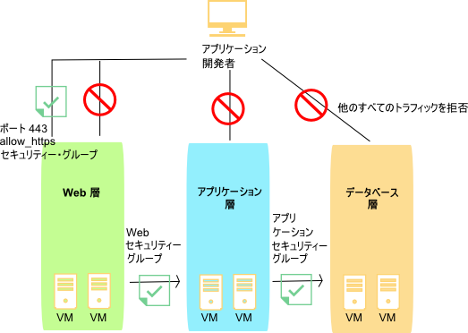

---

copyright:
  years: 2017
lastupdated: "2017-08-08"

---

{:shortdesc: .shortdesc}
{:new_window: target="_blank"}

# セキュリティー・グループの概要

## セキュリティー・グループとは
*セキュリティー・グループ* とは、仮想サーバー・インスタンスのパブリック・インターフェースとプライベート・インターフェースの両方について、入力 (進入) および出力 (退出) トラフィックを処理する方法を定義する一連の IP フィルター・ルールです。 セキュリティー・グループに追加するルールを*セキュリティー・グループ・ルール* と呼びます。
{:shortdesc}

* 複数のセキュリティー・グループを単一の仮想サーバー・インスタンスまたは複数の仮想サーバー・インスタンスのパブリックまたはプライベート (あるいはその両方の) ネットワーク・インターフェースに割り当てることができます。
* IBM が提供するセキュリティー・グループまたは独自に作成したセキュリティー・グループを割り当てることができます。
* セキュリティー・グループが仮想サーバー・インスタンスのネットワーク・コンポーネントに適用される場合、セキュリティー・グループ・ルールによって明示的に許可されていない限り、そのネットワーク・コンポーネントのすべての出入力トラフィックが拒否されます。
* 仮想サーバー・インスタンスへのインバウンド・トラフィックは、進入トラフィックと呼ばれます。
* 仮想サーバー・インスタンスからのアウトバウンド・トラフィックは、退出トラフィックと呼ばれます。

セキュリティー・グループは、仮想サーバーをホスティングするハイパーバイザーで実装されます。

## IBM が提供するセキュリティー・グループ
IBM が提供する以下のセキュリティー・グループを仮想サーバー・インスタンスのネットワーク・インターフェースに割り当てることができます。

* *allow_ssh*: このセキュリティー・グループは、SSH ポートでのみ進入 TCP トラフィックを許可する IP ルールを定義します (22/TCP)。
* *allow_http*: このセキュリティー・グループは、HTTP ポートでのみ進入トラフィックを許可する IP ルールを定義します (80/TCP)。
* *allow_https*: このセキュリティー・グループは、HTTPS ポートでのみ進入 TCP トラフィックを許可する IP ルールを定義します (443/TCP)。
* *allow_outbound*: このセキュリティー・グループは、サーバーからのすべての退出トラフィックを許可する IP ルールを定義します。
* *allow_all*: このセキュリティー・グループは、すべてのポートですべての進入トラフィックを許可する IP ルールを定義します。

## セキュリティー・グループと監査ログ
セキュリティー・グループの相互作用はすべて、アカウントの [監査ログ](https://console.bluemix.net/docs/customer-portal/cpmonenv.html#cp_viewacctauditlog)に記録されます。監査ログ項目では、特定のセキュリティー・グループの変更と、その変更を要求したユーザーを追跡します。以下の相互作用についてログが書き込まれます。
* 仮想サーバーのネットワーク・インターフェースに対して、セキュリティー・グループの追加または削除が行われた
* セキュリティー・グループのルールが、ルールの追加、ルールの編集、またはルールの削除によって変更された

そうした各相互作用について、影響を受けたオブジェクトごとに 1 つのログが書き込まれます。変更されているセキュリティー・グループに対して、ログが常に書き込まれます。セキュリティー・グループに接続された各仮想サーバー・ネットワーク・インターフェースについて、追加のログが書き込まれます。特定のセキュリティー・グループで監査ログをフィルタリングすると、そのグループについて、セキュリティー・グループ関連の変更がすべて表示されます。同様に、特定の仮想サーバーでログをフィルタリングすると、その仮想サーバーについて、セキュリティー・グループ関連の変更がすべて表示されます。

セキュリティー・グループの変更によって、バックグラウンドで多くの仮想サーバーが更新されることになる可能性があるため、監査ログを使用して、変更が正確にいつ有効になったかを判別することができます。監査ログを生成するセキュリティー・グループ API は、要求 ID を返します。この ID を使用して、API 呼び出しと、生成された監査ログとを相互に関連付けることができます。

## 例
次の図では、ネットワーク・トラフィックを制限するために、仮想サーバー・インスタンスが一連のセキュリティー・グループに関連付けられています。 矢印は、ネットワーク・トラフィックの流れを示しています。 アプリケーション開発者は、以下のように、各種のインフラストラクチャー層へのアクセスが制限されています。

* アプリケーション開発者は、TCP ポート 443 (https) 上の Web 層にのみアクセスできます。
* Web 層のインスタンスは、アプリケーション層のインスタンスにのみアクセスできます。
* アプリケーション層のインスタンスは、データベース層のインスタンスにのみアクセスできます。 

 図 1. セキュリティー・グループのイメージ

