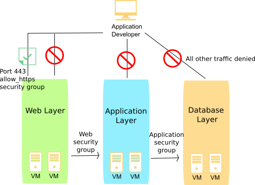

---

copyright:
  years: 2017
lastupdated: "2017-08-08"

---

{:shortdesc: .shortdesc}
{:new_window: target="_blank"}

# 보안 그룹 정보

## 보안 그룹의 개념
*보안 그룹*은 Virtual Server 인스턴스의 사설 및 공용 인터페이스 모두에 대한
수신(유입) 및 발신(유출) 트래픽을 처리하는 방법을 정의하는 IP 필터 규칙 세트입니다. 보안
그룹에 추가한 규칙을 *보안 그룹 규칙*이라고 합니다.
{:shortdesc}

* 단일 Virtual Server 또는 여러 Virtual Server 인스턴스의 공용 및/또는 사설 네트워크 인터페이스에 보안 그룹을 지정할 수 있습니다.
* IBM에서 제공하거나 사용자가 작성한 보안 그룹을 지정할 수 있습니다.
* 보안 그룹이 Virtual Server 인스턴스의 네트워크 컴포넌트에 적용되면, 보안 그룹 규칙을 통해 명시적으로 허용한 경우가 아니면 해당 네트워크 컴포넌트의 모든 트래픽이 거부됩니다.
* Virtual Server 인스턴스로의 인바운드 트래픽을 유입 트래픽이라고 합니다.
* Virtual Server 인스턴스로부터의 아웃바운드 트래픽을 유출 트래픽이라고 합니다.

보안 그룹은 Virtual Server를 호스트하는 하이퍼바이저에서 구현됩니다.

## IBM에서 제공하는 보안 그룹
IBM에서 제공하는 다음 보안 그룹을 Virtual Server 인스턴스의
네트워크 인터페이스에 지정할 수 있습니다.

* *allow_ssh*: 이 보안 그룹은 SSH 포트(22/TCP)에서만 유입 TCP 트래픽을 허용하는 IP 규칙을 정의합니다.
* *allow_http*: 이 보안 그룹은 HTTP 포트(80/TCP)에서만 유입 트래픽을 허용하는 IP 규칙을 정의합니다.
* *allow_https*: 이 보안 그룹은 HTTPS 포트(443/TCP)에서만 유입 TCP 트래픽을 허용하는 IP 규칙을 정의합니다.
* *allow_outbound*: 이 보안 그룹은 서버로부터의 모든 유출 트래픽을 허용하는 IP 규칙을 정의합니다.
* *allow_all*: 이 보안 그룹은 모든 포트에서 모든 유입 트래픽을 허용하는 IP 규칙을 정의합니다.

## 보안 그룹 및 감사 로그
모든 보안 그룹 상호작용이 계정의 [감사 로그](https://console.bluemix.net/docs/customer-portal/cpmonenv.html#cp_viewacctauditlog)에 로깅됩니다. 감사 로그 항목은 특정한 보안 그룹 변경사항과 변경을 요청한 사용자를 추적합니다. 다음 상호작용에 대해 로그가 기록됩니다.
* Virtual Server의 네트워크 인터페이스에서 보안 그룹이 추가되고 제거됩니다.
* 추가 규칙, 편집 규칙 또는 제거 규칙를 사용하여 보안 그룹의 규칙을 변경합니다.

이러한 각각의 상호작용에 대해 영향을 받는 각 오브젝트에 대한 하나의 로그가 기록됩니다. 로그는 항상 변경 중인 보안 그룹에 대해 기록됩니다. 보안 그룹에 연결된 각 Virtual Server 네트워크 인터페이스에 대해 추가 로그가 기록됩니다. 특정 보안 그룹에 대한 감사 로그를 필터링하여 해당 그룹에 대한 모든 보안 그룹 관련 변경사항을 표시할 수 있습니다. 마찬가지로 특정 Virtual Server에 대한 로그를 필터링하여 해당 Virtual Server에 대한 모든 보안 그룹 관련 변경사항을 표시할 수 있습니다.

보안 그룹을 변경하면 많은 Virtual Server가 백그라운드에서 업데이트될 수 있으므로 감사 로그를 사용하여 변경사항이 적용된 시점을 정확하게 판별할 수 있습니다. 감사 로그를 생성하는 보안 그룹 API는 요청 ID를 리턴합니다. 해당 ID를 사용하여 API 호출과 생성되는 감사 로그의 상관 관계를 확인할 수 있습니다.

## 예
다음 다이어그램에서 Virtual Server 인스턴스는
네트워크 트래픽을 제한하는 보안 그룹 세트와 연관되어 있습니다. 화살표는 네트워크 트래픽 플로우를 나타냅니다. 애플리케이션 개발자는 다음과 같이 다양한 인프라 계층에 대한 액세스가 제한되어 있습니다.

* 애플리케이션 개발자는 TCP 포트 443(https)의 웹 계층에만 액세스할 수 있습니다.
* 웹 계층 인스턴스만 애플리케이션 계층 인스턴스에 액세스할 수 있습니다.
* 애플리케이션 계층 인스턴스만 데이터베이스 계층 인스턴스에 액세스할 수 있습니다. 

 그림 1. 보안 그룹 이미지

