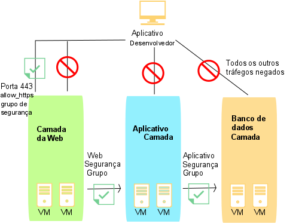

---

copyright:
  years: 2017
lastupdated: "2017-08-08"

---

{:shortdesc: .shortdesc}
{:new_window: target="_blank"}

# Sobre grupos de segurança

## O que é um grupo de segurança?
Um *grupo de segurança* é um conjunto de regras de filtro de IP que definem como manipular o tráfego de
entrada (ingresso) e de saída (egresso) para as interfaces pública e privada de uma instância de servidor virtual. As
regras que você inclui em um grupo de segurança são conhecidas como *regras de grupo de segurança*.
{:shortdesc}

* É possível designar grupos de segurança às interfaces de rede públicas e/ou privadas de um único servidor virtual ou de múltiplas instâncias de servidor virtual.
* É possível designar grupos de segurança que são fornecidos pela IBM ou que você cria.
* Quando um grupo de segurança é aplicado a um componente de rede de uma instância de servidor virtual, todo o tráfego para esse componente e a partir dele é negado, a menos que seja expressamente permitido por uma regra do grupo de segurança.
* O tráfego de entrada para uma instância de servidor virtual é referido como tráfego de ingresso.
* O tráfego de saída de uma instância de servidor virtual é referido como tráfego egresso.

Os grupos de segurança são implementados no hypervisor que hospeda o servidor virtual.

## Grupos de segurança fornecidos pela IBM
É possível designar qualquer um dos grupos de segurança a seguir que são fornecidos pela IBM para as interfaces
de rede de suas instâncias de servidor virtual:

* *allow_ssh*: este grupo de segurança define as regras de IP que permitem o tráfego TCP de ingresso somente na porta SSH (22/TCP).
* *allow_http*: este grupo de segurança define as regras de IP que permitem o tráfego de ingresso somente na porta HTTP (80/TCP).
* *allow_https*: este grupo de segurança define as regras de IP que permitem o tráfego TCP de ingresso somente na porta HTTPS (443/TCP).
* *allow_outbound*: este grupo de segurança define as regras de IP que permitem todo o tráfego egresso do servidor.
* *allow_all*: este grupo de segurança define as regras de IP que permitem todo o tráfego de ingresso em todas as portas.

## Grupos de segurança e logs de auditoria
Todas as interações de grupo de segurança são registradas em um [log de auditoria](https://console.bluemix.net/docs/customer-portal/cpmonenv.html#cp_viewacctauditlog) da conta. Entradas de log de auditoria controlam mudanças de grupo de segurança específicas e qual usuário solicitou a mudança. Logs são gravados para as interações a seguir:
* Um grupo de segurança é incluído em ou removido de uma interface de rede do servidor virtual
* As regras do grupo de segurança são mudadas por incluir regra, editar regra ou remover regra.

Para cada uma dessas interações, um log é gravado para cada objeto afetado. Um log será sempre gravado com relação ao grupo de segurança que estiver sendo mudado. Os logs adicionais são gravados para cada interface de rede do servidor virtual anexada ao grupo de segurança. Filtrar logs de auditoria em um grupo de segurança específico mostra todas as mudanças relacionadas ao grupo de segurança para o grupo. Da mesma forma, a filtragem de logs em um servidor virtual específico mostra todas as mudanças relacionadas ao grupo de segurança para o servidor virtual.

Como as mudanças do grupo de segurança podem resultar em uma série de servidores virtuais sendo atualizados no segundo plano, os logs de auditoria poderão ser usados para determinar precisamente quando uma mudança entrou em vigor. APIs do grupo de segurança que geram logs de auditoria retornam um identificador de solicitação. Esse identificador pode ser usado para correlacionar chamadas API com seus logs de auditoria resultantes.

## Example
No diagrama a seguir, as instâncias do servidor virtual estão associadas a um conjunto de grupos de segurança para restringir o tráfego de rede. As setas representam o fluxo de tráfego de rede. O desenvolvedor de aplicativos tem acesso restrito a várias camadas de infraestrutura, da seguinte forma:

* O desenvolvedor de aplicativos pode acessar apenas a camada da web na porta TCP 443 (https).
* Apenas as instâncias da camada da web podem acessar as instâncias da camada de aplicativo.
* Apenas as instâncias da camada de aplicativos podem acessar as instâncias da camada de banco de dados. 

 Figura 1. Imagem do grupo de segurança

