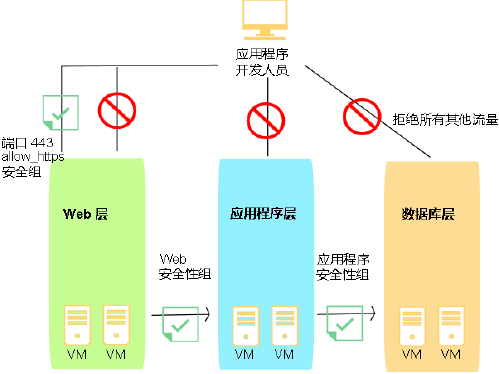

---

copyright:
  years: 2017
lastupdated: "2018-11-10"

---

{:shortdesc: .shortdesc}
{:new_window: target="_blank"}

# 有关 IBM 安全组
{: #about-ibm-security-groups}

## 什么是安全组？
*安全组*是一组 IP 过滤器规则，这些规则用于定义如何处理通过虚拟服务器实例的公共和专用接口的入局（入口）和出局（出口）流量。向安全组中添加的规则称为*安全组规则*。
{:shortdesc}

* 您可以将安全组分配给单个虚拟服务器或多个虚拟服务器实例的公共和/或专用网络接口。
* 您可以分配 IBM© 提供的或者您自己创建的安全组。
* 如果对虚拟服务器实例的某个网络组件应用安全组，除非安全组规则明确允许，否则会拒绝该网络组件的所有进出流量。
* 虚拟服务器实例的入站流量称为入口流量。
* 虚拟服务器实例的出站流量称为输出流量。

安全组在托管虚拟服务器的管理程序上实施。

## IBM 提供的安全组
您可以将 IBM 提供的以下任何安全组分配给虚拟服务器实例的网络接口：

* *allow_ssh*：此安全组定义的 IP 规则仅允许 SSH 端口上的入口 TCP 流量 (22/TCP)。
* *allow_http*：此安全组定义的 IP 规则仅允许 HTTP 端口上的入口流量 (80/TCP)。
* *allow_https*：此安全组定义的 IP 规则仅允许 HTTPS 端口上的入口 TCP 流量 (443/TCP)。
* *allow_outbound*：此安全组定义的 IP 规则允许传出服务器的所有输出流量。
* *allow_all*：此安全组定义的 IP 规则允许所有端口上的所有入口流量。

## 安全组和审计日志
所有安全组交互都记录在帐户的审计日志条目中，跟踪特定安全组更改以及哪个用户请求了更改。针对以下交互会写入日志：
* 在虚拟服务器的网络接口中添加或除去安全组
* 通过添加规则、编辑规则或除去规则来更改安全组的规则

对于其中每个交互，将针对每个受影响的对象写入一个日志。将始终针对所更改的安全组写入一个日志。针对连接到安全组的每个虚拟服务器网络接口，将写入其他日志。过滤特定安全组上的审计日志将显示该组的所有与安全组相关的更改。同样，过滤特定虚拟服务器上的日志将显示该虚拟服务器的所有与安全组相关的更改。

由于安全组更改可能导致在后台更新若干虚拟服务器，因此可以使用审计日志来精确确定更改何时生效。生成审计日志的安全组 API 将返回请求标识。该标识可用于将 API 调用与生成的审计日志相关联。

## 示例
在下图中，虚拟服务器实例与一组安全组关联以限制网络流量。箭头表示网络流量流程。应用程序开发者对于各种基础结构层的访问存在以下限制：

* 应用程序开发者仅可通过 TCP 端口 443 (https) 访问 Web 层。
* 仅 Web 层实例可访问应用程序层实例。
* 仅应用程序层实例可访问数据库层实例。

 图 1. 安全组图像
