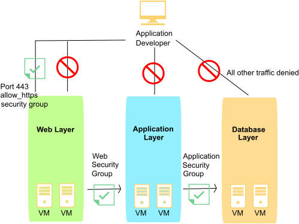

---

copyright:
  years: 2017, 2025
lastupdated: "2025-02-25"

keywords: overview, logs, audit, features

subcollection: security-groups

---

{{site.data.keyword.attribute-definition-list}}

# About IBM security groups
{: #about-ibm-security-groups}

An {{site.data.keyword.cloud}} security group is a set of IP filter rules that define how to handle incoming (ingress) and
outgoing (egress) traffic to both the public and private interfaces of a virtual server instance. The rules that you add to a security group are known as security group rules.
{: shortdesc}

* You can assign security groups to the public and/or private network interfaces of a single virtual server or multiple virtual server instances.
* You can assign security groups that are provided by IBM or that you create.
* When a security group is applied to the network component of a virtual server instance, all traffic to and from that network component is denied, unless explicitly permitted by a security group rule.
* The inbound traffic to a virtual server instance is referred to as ingress traffic.
* The outbound traffic from a virtual server instance is referred to as egress traffic.

Security groups are implemented on the hypervisor hosting the virtual server.

## Security groups provided by IBM
{: #security-groups-provided-by-ibm}

You can assign any of the following security groups that are provided by IBM to the network interfaces of your virtual server instances:

* **allow_ssh** - This security group defines the IP rules that allow ingress TCP traffic on the SSH port only (22/TCP).
* **allow_http** - This security group defines the IP rules that allow ingress traffic on HTTP port only (80/TCP).
* **allow_https** - This security group defines the IP rules that allow ingress TCP traffic on HTTPS port only (443/TCP).
* **allow_outbound** - This security group defines the IP rules that allow all egress traffic from the server.
* **allow_all** - This security group defines the IP rules that allow all ingress traffic on all ports.

## Security groups and audit logs
{: #security-groups-and-audit-logs}

All security group interactions are logged to an account's audit log. The entries track specific security group changes as well as which user requested the change. Logs are written for the following interactions:
* A security group is added to or removed from a virtual server's network interface.
* A security group's rules are changed by add rule, edit rule, or remove rule.

For each of those interactions, one log is written for each affected object. A log is always written against the security group being changed. Additional logs are written for each virtual server network interface attached to the security group. Filtering audit logs on a specific security group shows all security group related changes for the group. Likewise, filtering logs on a specific virtual server shows all security group related changes for the virtual server.

Since security group changes can result in a number of virtual servers being updated in the background, audit logs can be used to determine precisely when a change went into effect.  Security group APIs that generate audit logs return a request identifier. That identifier can be used to correlate API calls with their resulting audit logs.

## Using a security group as a source or destination

When creating rules within a security group, one option is to set a security group as either the source or destination for traffic flow. This essentially does two things. First, it creates a group of IP addresses defined by the servers attached to the specified security group. Secondly, it sets that group of IPs as the source or destination for traffic. This allows you to group servers by function and references that group in a rule. For example, on your account, you can create one security group for all web servers and another for all database servers, defining the security groups by server type. To allow traffic from web servers to database servers, you can then create a rule within the web server security group. setting the destination as the database server security group (with the proper destination port and protocol set within the rule).

Each security group can be referenced as a source or destination within other security groups a default maximum of 5 times total throughout the account.

## Security group example
{: #example-2}

In the following diagram, virtual server instances are associated with a set of security groups to restrict network traffic. The arrows represent network traffic flow. The application developer has restricted access to the various infrastructure layers, as follows:

* The application developer can access only the web layer on TCP port 443 (HTTPS).
* Only web layer instances can access the application layer instances.
* Only the application layer instances can access the database layer instances.

{: caption="Security group image" caption-side="bottom"}
